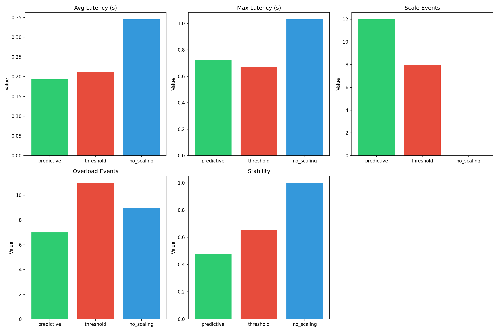
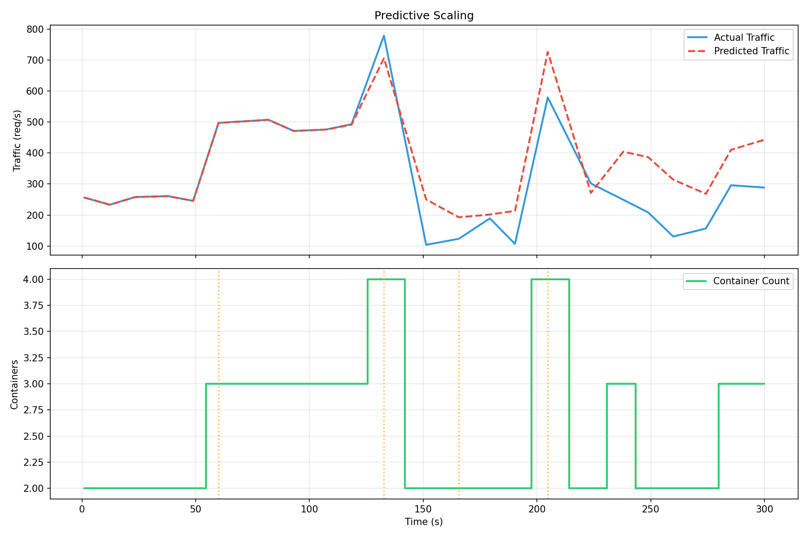
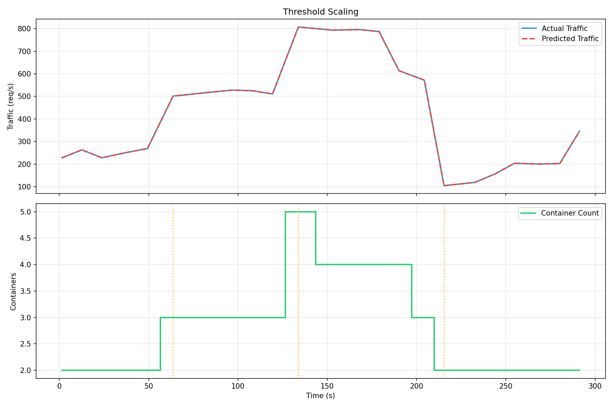
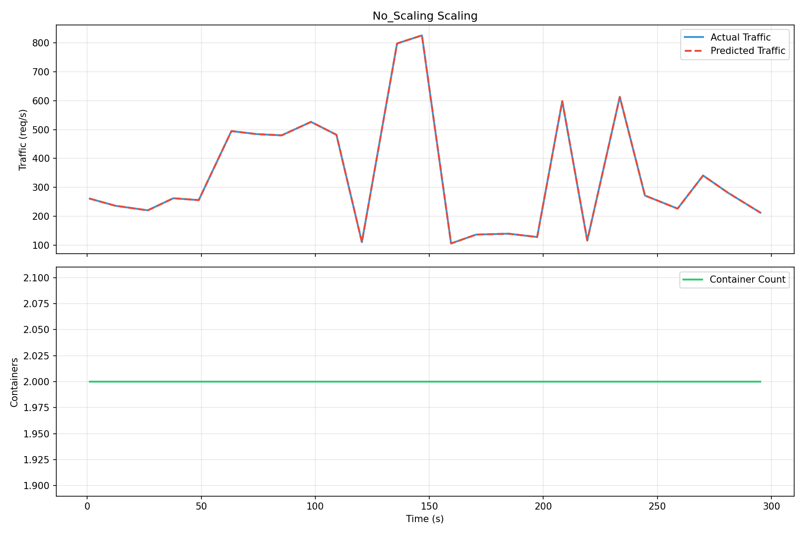

# ScaleWise - Agentic AIOps for Predictive Auto Scaling

System for proactive network performance management using machine learning and Docker container auto-scaling.

## Overview

This project implements an end-to-end AIOps system that:
- Uses machine learning to predict future network traffic
- Performs proactive auto-scaling of containerized services
- Demonstrates that AI-driven predictive scaling outperforms traditional threshold-based scaling

### Sample Results



### Predictive Mode Scaling Events



### Threshold Mode Scaling Events



### No Scaling Mode (Baseline)



## Architecture

```
┌─────────────────┐     ┌──────────────────────┐     ┌─────────────────┐
│  Traffic        │────▶│  Prediction Service  │────▶│  Decision       │
│  Generator      │     │  (FastAPI + ML)      │     │  Engine         │
└─────────────────┘     └──────────────────────┘     └────────┬────────┘
                                                               │
                                                               ▼
┌─────────────────┐     ┌──────────────────────┐     ┌────────┴────────┐
│  Prometheus     │◀────│  Docker Compose      │◀────│  Auto Scaling  │
│  + Grafana      │     │  (Webapp Containers)│     │  Controller    │
└─────────────────┘     └──────────────────────┘     └─────────────────┘
```

## Quick Start

### Prerequisites
- Python 3.10+
- Docker & Docker Compose

### 1. Install Dependencies

```bash
cd ~/AIOps
python3 -m venv venv
source venv/bin/activate
pip install -r src/requirements.txt
```

### 2. Train Model

```bash
python scripts/train_model.py
```

This generates synthetic traffic data and trains the ML model.

### 3. Start Docker Containers

```bash
cd docker
docker compose up --build -d
```

### 4. Run Demo (3 Scenarios)

**Important: Run traffic generator AND controller in parallel for each scenario.**

#### Scenario 1: No Scaling (Baseline)

```bash
# Terminal 1: Generate traffic
python scripts/traffic_generator.py --url http://localhost:5000 --duration 300 --stress --workers 30

# Terminal 2: Run controller (no scaling - baseline)
python src/controller/auto_scaling_controller.py --mode no_scaling --duration 300
```

#### Scenario 2: Threshold-based (Reactive)

```bash
# Terminal 1: Generate traffic
python scripts/traffic_generator.py --url http://localhost:5000 --duration 300 --stress --workers 30

# Terminal 2: Run controller
python src/controller/auto_scaling_controller.py --mode threshold --duration 300
```

#### Scenario 3: Predictive AI (Proactive) - Recommended

```bash
# Terminal 1: Generate traffic
python scripts/traffic_generator.py --url http://localhost:5000 --duration 300 --stress --workers 30

# Terminal 2: Run controller
python src/controller/auto_scaling_controller.py --mode predictive --duration 300
```

#### Reset data after each scenario run
```bash
cd docker && docker compose down && docker volume rm docker_prometheus-data 2>/dev/null; docker compose up -d
```

### 5. Evaluate Results

```bash
python scripts/evaluate.py
```

This generates comparison charts and a detailed report.

## Services

| Service | URL | Description |
|---------|-----|-------------|
| Webapp | http://localhost:5000 | Flask application |
| Prediction | http://localhost:8000 | FastAPI ML service |
| Prometheus | http://localhost:9090 | Metrics collection |
| Grafana | http://localhost:3000 | Dashboards (admin/admin) |

## Testing Prediction Service

```bash
curl -X POST http://localhost:8000/predict \
  -H "Content-Type: application/json" \
  -d '{"traffic_data": [100, 150, 200, 180, 220, 250, 300, 280, 320, 350]}'
```

## Configuration

Key parameters in `auto_scaling_controller.py`:

| Parameter | Default | Description |
|-----------|---------|-------------|
| `--mode` | predictive | scaling mode (predictive/threshold/no_scaling) |
| `--duration` | 300 | run duration in seconds |
| `--capacity` | 200 | requests per container per second |
| `--min-containers` | 2 | minimum replicas |
| `--max-containers` | 10 | maximum replicas |
| `--scale-up` | 0.8 | scale up threshold (utilization > 80%) |
| `--scale-down` | 0.3 | scale down threshold (utilization < 30%) |

## Project Structure

```
ScaleWise/
├── src/
│   ├── preprocessing/      # Data preprocessing
│   ├── model/             # ML model (sklearn-based)
│   ├── service/           # FastAPI prediction service
│   ├── decision_engine/   # Scaling decision logic
│   ├── controller/        # Auto scaling controller
│   └── monitoring/        # Prometheus monitoring
├── webapp/                # Flask web application
├── docker/                # Docker configurations
├── scripts/               # Training & evaluation scripts
├── models/                # Trained models
├── experiments/          # Results & visualizations
└── README.md
```

## How It Works

1. **Traffic Generation**: Generates realistic traffic patterns with spikes and daily/hourly patterns
2. **Model Training**: Trains a Gradient Boosting model on sliding window sequences
3. **Prediction**: Service accepts recent 10 traffic data points, returns predicted next value
4. **Decision Engine**:
   - **Predictive Mode**: Scales BEFORE overload based on predicted traffic (proactive)
   - **Threshold Mode**: Scales AFTER overload is detected (reactive)
   - **No Scaling**: Fixed container count (baseline)
5. **Auto Scaling**: Adjusts container count via Docker Compose
6. **Monitoring**: Prometheus collects metrics, Grafana visualizes

## Demo Traffic Pattern

The demo uses a 5-minute traffic pattern:

| Time (seconds) | Traffic | Utilization (2 containers) | Expected Behavior |
|----------------|---------|------------------------------|---------------------|
| 0-60 | 250 RPS | 62.5% | Normal |
| 60-120 | 500 RPS | 125% | OVERLOAD |
| 120-180 | 800 RPS | 200% | SEVERE OVERLOAD |
| 180-240 | 600 RPS | 150% | OVERLOAD |
| 240-300 | 250 RPS | 62.5% | Recovery |

**Expected Results:**
- **No Scaling**: High latency (overload throughout)
- **Threshold**: Medium latency (scales after overload)
- **Predictive**: Low latency (scales before overload)

## Evaluation

The system compares three scenarios and outputs:

- Average/Max latency
- Throughput
- Scale events
- Overload events
- Stability score


## License

MIT
